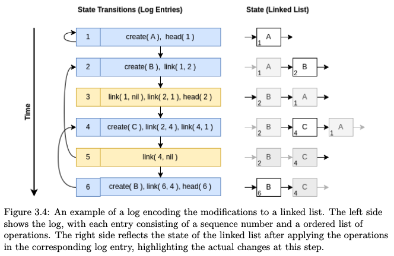

# Rollover Lists and Sets (RoloLIST and RoloSET)

How can we publish a mutable data structure via an immutable
storage stream such that the stream can always be pruned?

This question emerges in the context of replicated append-only
logs. We wish to use append-only logs as a replication mechanism
because of their simple synchronization protocol (two peers just have
to compare their replica's height in order to find out which replica
contains more recent data). But because the logs are immutable,
storing information updates regarding higher-level objects will
accumulate in an unbounded way.

In this work we show how specific higher-level data structures, a
dynamic list and a dynamic set, can be mapped to an unbounded
append-only log yet we keep the relevant data in an optimally bounded
section of the log. In other words, our encoding of the mutable list
and set permits to always prune the log, meaning that we can ignore
all log entries older that some cutoff point. The following picture
explains our approach of how we handle the seemingly contradicting
"immutability" vs "continuously evolving" properties:


The current state of a list is stored in the red section of the log.
This includes information about the modification of the list, which is
added at the front of the log. In order to bound the red section and
declare _all entries older than the cutoff point_ (shown in green)
as being obsolete, most of the time it will be necessary to copy old
data to the front. The trick is to store enough "ordering information"
with the data such that old list elements can be sitting at the front
of the log, if necessary.

## History

This work is an extension of a technique described in the MSc thesis
of Sebastian Philipp at the University of Basel, 2022 with the
title _"Memory-Bounded Replication of Mutable Data Structures over
Immutable Append-Only Logs"_.

Philipp's encoding for a list data structure is based on storing,
per log entry, one to three basic operation types: "create", "link"
and "head". In this way, insertion as well as deletion can be modeled
as is shown in the example of Figure 3.4, extracted from his report:



Based on the same approach, we extend Philipp's technique by adding an
aggressive pruning strategy using "rollovers": Unless the
modification of the list is about adding or replacing a element (in
which case we may have to grow the "red section"), all other actions
must lead to pruning at least one log entry. In case that the
to-be-pruned entry contains still relevant data, we copy its content
as well as "link rewirings" to the front of the log. This must be done
in a careful way as it impacts the main action on the list: For
example, deleting an element requires updating pointers in the
adjacent elements, but now with the catch that one of these elements
could have been moved from the back to the front of the log. This means that
we have to update the updating information before writing the rewiring
details to the log.

## Log Entry Encoding, Examples

For the current implementation in Python we chose an internal
double-linked list approach for storing the higher-level list and set data
structures in memory. Not all of this has to be documented in the log.
It suffices to store only the ```prev``` links because the other
direction (```next```) can be computed based on the in-memory
data. Differently from Philipp, we chose to keep track of a tail
pointer instead of head, assuming that it is more frequent that
elements are appended to a list or set. Overall we also have three
low-level operations to encode the high-level action:

```
value "some data"      // corresponds to 'create'
link (at, to)          // in element 'at' replace the prev link by 'to' or nil
tail (to)              // define the new tail element value, can be nil
```

where ```at``` and ```to``` are pointers in form of sequence numbers,
identifying what log entry is referenced. As with Philipp's encoding,
the default field values are ```nil``` when a new node is created with
a ```value``` operation.

The empty list is encoded as
```
#1534 (tail nil)
```

```1534``` in this example is the sequence number at which the relevant
log entries start; the rest of the line shows what is stored in the log
at this entry.


A one-element list ```['sole element']``` would be encoded in the log as:
```
#4475  (value "sole element"), (tail 4475)
```

The two-element list ``['first element','2nd element']``` can be encoded as:
```
#6523  (value "first element"), tail(6523)
#6524  (value "2nd element"), link(6524, 6523), tail(6524)
```

If a rollover happens, the internal linked list order will be different
from the log storage order. Using the same content as before, we have:

```
#6524  (value "2nd element"),  link(6524, 6523), tail(6524)
#6525  (value "first element"), link(6524, 6525)
```

As one can see, the value for the first list element is re-added to
the log at the front (note that implicitly the ```prev``` pointer is
set to ```nil```).  But because the first element has changed its locations,
we need to relink the ```prev``` link of the second element (stored at #6524)
and let it point to #6525, which also is part of operations in entry #6525.
The tail information defined in entry #6524 is still valid and does not need
changing.


## Replay for Reconstruction

The last example shows that the contents of log entries are not
necessarily valid, if taken out of context: Clearly, #6524 contains
wrong pointer data. But the log's content is immutable and we have to
consider all subsequent entries that modify the (in-memory) data
structure.

Our basic requirement is that the list's or set's content can be fully
reconstructed by replaying exactly the log elements in the "red
section".

In our implementation we do this by sequentially executing the
operations in the log entries and updating the in-memory representation
of the list or set. In case of a full reconstruction from scratch, a first
pass reads all log entries after the prune cutoff point, creating
nodes (for each ```value``` commend), defining the ```prev``` link
pointers where told to do so, and setting the current tail
value. When completed, a second pass is necessary, now over the
in-memory single-linked list, in order to creating the ```next```
pointer values needed in our desired in-memory double-linked list.
All nodes that were created in this process but which are not part of
the final double-linked list are not elements of the high-level and can be
removed.

## Example of a Space-Efficient Wire-Bits Encoding

The RoloLIST and -SET project is a side result of tinySSB where all
append-only-log entries have a constant length of 120B from which only
48 Bytes are available for data to be stored. One of the log entry types
permits to use the full 48B without triggering the use of so called
side-chains.

... to be completed ...


## A Python Library

...

## Demo

...

---


